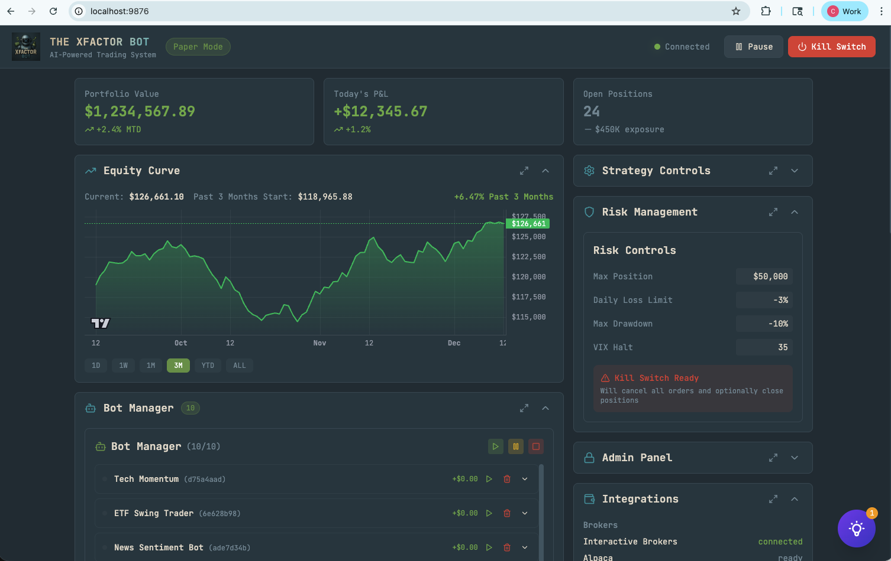

# ⚡ XFactor Bot - AI-Powered Automated Trading System

An advanced algorithmic trading platform with multi-broker support, real-time news sentiment analysis, and AI-powered decision making.



## 🚀 Features

### Multi-Broker Trading
- **Interactive Brokers (IBKR)** - Full integration for stocks, options, futures
- **Alpaca** - Commission-free trading with excellent API
- **Charles Schwab** - OAuth2 integration
- **Tradier** - Low-cost options trading

### Trading Bots (100 Max)
| Category | Bots | Description |
|----------|------|-------------|
| **Stock Bots** | 10 | Tech momentum, ETF swing, sector-specific |
| **Options Bots** | 5 | SPY/QQQ calls, 0DTE scalping, earnings plays |
| **Futures Bots** | 4 | ES/NQ scalping, micro futures |
| **Leveraged ETF** | 2 | TQQQ/SQQQ and SOXL swing trading |
| **Commodity Bots** | 8 | Gold, silver, oil, natural gas |
| **Crypto Bots** | 8 | BTC, ETH, and altcoins |

### Desktop Application
- **macOS**: Apple Silicon (ARM64) and Intel (x64) DMG installers
- **Windows**: MSI and EXE installers
- **Linux**: DEB package
- Auto-launches backend, system tray, native menus

### News & Sentiment Intelligence
- 100+ global news sources (Reuters, Bloomberg, WSJ, Caixin, Nikkei, etc.)
- Real-time sentiment analysis using FinBERT & GPT-4
- Top trader tracking (Unusual Whales, Cheddar Flow, etc.)
- OpenInsider SEC Form 4 filings integration
- Finviz signals and unusual volume alerts
- Local file parsing (CSV, PDF, DOCX) via `new_news/` folder

### Risk Management
- Real-time VaR calculations
- Max drawdown protection
- Daily/weekly loss limits
- VIX-based circuit breakers
- Position sizing with Kelly Criterion

### Banking Integration (Plaid)
- Link bank accounts securely
- ACH deposits/withdrawals
- Balance verification

### MCP Server (AI Integration)
Exposes trading tools for AI assistants:
- Portfolio queries
- Market data access
- Trade execution (with confirmation)
- Performance analytics

## 📋 Requirements

- Python 3.11+
- Node.js 18+
- Docker & Docker Compose
- Interactive Brokers TWS/Gateway (for live trading)

## 🛠️ Installation

### 1. Clone the repository
```bash
git clone https://gitlab-master.nvidia.com/cvanthin/000_trading.git
cd 000_trading
```

### 2. Set up Python environment
```bash
python3.12 -m venv .venv
source .venv/bin/activate
pip install -r requirements.txt
```

### 3. Configure environment
```bash
cp .env.example .env
# Edit .env with your API keys
```

### 4. Start with Docker
```bash
docker compose -f xfactor-bot/docker-compose.yml up -d
```

### 5. Start the frontend
```bash
cd frontend
npm install
npm run dev
```

## 🌐 Access

| Service | URL | Description |
|---------|-----|-------------|
| **Dashboard** | http://localhost:9876 | React control panel |
| **API** | http://localhost:8765 | FastAPI backend |
| **Grafana** | http://localhost:3001 | Monitoring dashboards |
| **Prometheus** | http://localhost:9090 | Metrics |

## ⚙️ Configuration

### Broker API Keys
```env
# Alpaca
ALPACA_API_KEY=your_key
ALPACA_SECRET_KEY=your_secret
ALPACA_PAPER=true

# Schwab
SCHWAB_CLIENT_ID=your_app_key
SCHWAB_CLIENT_SECRET=your_secret

# IBKR
IBKR_HOST=127.0.0.1
IBKR_PORT=7497
```

### Data Sources
```env
# News APIs
BENZINGA_API_KEY=your_key
NEWSAPI_API_KEY=your_key
FINNHUB_API_KEY=your_key

# Market Data
POLYGON_API_KEY=your_key
ALPHA_VANTAGE_API_KEY=your_key

# TradingView Webhooks
TRADINGVIEW_WEBHOOK_SECRET=your_secret
```

### Banking (Plaid)
```env
PLAID_CLIENT_ID=your_client_id
PLAID_SECRET=your_secret
PLAID_ENVIRONMENT=sandbox
```

### AI (Multiple Providers Supported)
```env
# OpenAI
OPENAI_API_KEY=your_key

# Anthropic Claude
ANTHROPIC_API_KEY=your_key

# Ollama (local, no key needed)
OLLAMA_HOST=http://localhost:11434
```

## 🏗️ Architecture

```
├── src/
│   ├── api/              # FastAPI backend
│   ├── bot/              # Bot manager & instances
│   ├── brokers/          # Multi-broker integrations
│   ├── banking/          # Plaid integration
│   ├── data_sources/     # Market data providers
│   ├── news_intel/       # News aggregation & sentiment
│   ├── strategies/       # Trading strategies
│   ├── risk/             # Risk management
│   ├── mcp/              # MCP server for AI tools
│   └── monitoring/       # Prometheus metrics
├── frontend/             # React dashboard
├── xfactor-bot/          # Docker configuration
└── new_news/             # Local news file drop folder
```

## 📊 Dashboard Features

- **Live News Feed** - 100 items with pagination, sentiment filtering
- **Bot Manager** - Start/stop/configure 25 trading bots
- **Equity Curve** - Interactive chart with time range filters
- **Top Traders** - Follow popular options flow traders
- **OpenInsider** - SEC Form 4 insider trading filings
- **Finviz Signals** - Unusual volume & breakout alerts
- **Risk Controls** - Real-time risk parameter adjustment
- **Admin Panel** - Password-protected system controls

## 🔒 Security

- Admin panel password protection (default: `106431`)
- OAuth2 for broker authentication
- Encrypted API key storage
- CORS protection

## 📈 Strategies

| Strategy | Description |
|----------|-------------|
| **Technical** | RSI, MACD, Moving Averages |
| **Momentum** | Price momentum & volume analysis |
| **Mean Reversion** | Fade extreme moves |
| **News Sentiment** | React to breaking news with NLP |

## 🚧 Roadmap

- [x] Desktop app (Tauri) for 24/7 local operation
- [x] Cross-platform builds (macOS ARM64/x64, Windows, Linux)
- [x] Multiple AI provider support (OpenAI, Claude, Ollama)
- [ ] Helium 10 integration (pending API availability)
- [ ] Additional crypto exchange support
- [ ] Mobile app

## 📄 License

Proprietary - Internal use only

## 👤 Author
Chan
